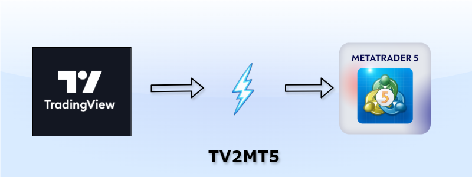

# TradingView to MT5 Trade Copier (TV2MT5)

##  [System Architecture](./docs/SystemArchitecture.md)
##  [Setup and Installation](./docs/Setup.md)

> Bridge the gap between TradingView's superior charting platform and MetaTrader5's robust trading ecosystem. Execute trades seamlessly, manage positions effortlessly - all while using your preferred platforms.

# 🚀 Overview

TradingView to MT5 Copier (TV2MT5) is a powerful tool that connects TradingView's advanced charting capabilities with MetaTrader5's execution environment. This bridge enables traders to use TradingView for analysis and execute trades directly on TradingView while seamlessly syncing all actions with their MT5 platform. Whether you're a scalper managing multiple screens or a day/swing trader checking positions on the go, this tool provides the flexibility and reliability you need.

## Key Features

- 🔄 Real-time trade synchronization between platforms
- 🌐 Works with any MT5 broker
- 📱 Multi-device compatibility
- 🔒 Secure trade execution
- ⚡ Lightning-fast order routing
- 📊 Position tracking across platforms

# 💡 Motivation 

## The Trading Platform Dilemma

In today's trading landscape, we face a peculiar disconnect. MetaTrader5 (MT5) is the industry standard, offered by nearly every broker. Meanwhile, TradingView has emerged as the preferred charting platform for modern traders, offering superior analysis tools and a more intuitive interface. However, bridging these two platforms often presents significant challenges:

### Common Challenges

1. **Limited Integration Options**
   - Many brokers don't offer TradingView integration
   - Some offer TradingView but without MT5 connectivity
   - Available integrations often route to higher-cost platforms like cTrader
   - Prop firms, while MT5-centric, rarely provide TradingView integration

## The Solution

This tool was built from the ground up to solve these pain points, offering traders the best of both worlds:

- **Chart and Execute**: Use TradingView's superior charting tools while executing trades directly on MT5
- **Seamless Synchronization**: Trades placed on TradingView appear instantly on MT5
- **Multi-Platform Access**: Monitor and manage positions across:
  - MT5 Desktop
  - MT5 WebTrader
  - MT5 Mobile App

## Real-World Trading Freedom

### Benefits
- Place trades from your professional workspace during active hours
- Close positions from your MT5 mobile app while relaxing at home
- No need to power up your multi-monitor setup for quick position management

## Trade Flow Intelligence

- **TradingView → MT5**: All trades placed on TradingView automatically execute on MT5 in realtime
- **Position Closing**: Works bi-directionally - close on either platform
- **Smart Routing**: New positions can only be initiated from TradingView for consistency

## Flexible Implementation

### Account Setup Strategy
1. **TradingView Account**: 
   - Open a DEMO account with any broker
   - Choose based on preferred charting features
   - Example: Oanda/ICMarkets for superior chart rendering

2. **MT5 Live Account**: 
   - Select any broker for actual LIVE trading
   - Choose based on commission structures and spreads
   - Example: FusionMarkets for competitive pricing

#### Developer Contact: abhi358@gmail.com

## 💝 Support the Project

If you find this tool helpful and want to support its continued development, you can contribute in the following ways:

### Cryptocurrency Donations
- **Bitcoin**: `bc1qv734cfcwlm9l34da7naeqkvu7taf9mp9g8c0hh`
- **Ethereum**: `0x024e8D8A0F74b5966C86ef7FFefA6358d3713497`
- **USDT (TRC20)**: `TVcA2grqRLkB91S9LrfqaNM1ro7GYTP9dU`

### Other Ways to Support
- ⭐ Star this repository
- 🐛 Report bugs and contribute fixes
- 💡 Suggest new features and improvements
- 📖 Help improve documentation

Your support helps keep this project maintained and free for everyone! 🙏

## License

MIT License - see LICENSE file for details.