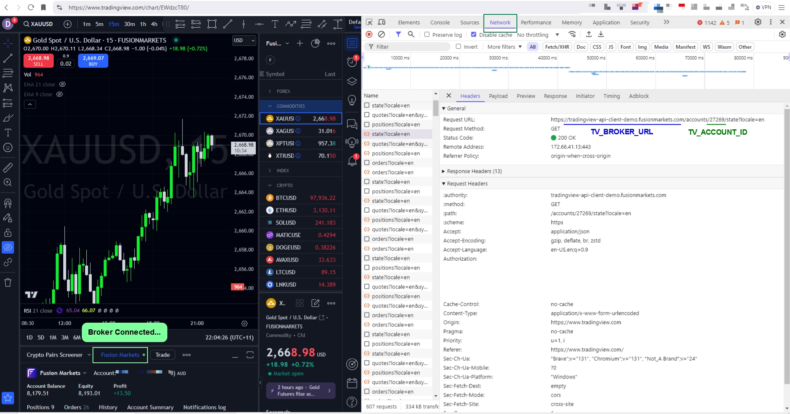

Your TradingView `ACCOUNT_ID` is NOT the same as your Broker provided username, userId, TradingView login email, broker login email, cTraderId, MT4/MT5 id or any other ids.
There are high chances that you have never seen or heard of this id. This id can be found in the network calls of your browser after you are logging in to TradingView and inspecting the Network tab.
Below are the steps on how to find it:

1. Login to TradingView as usual using your TradingView email and password
2. Once logged in, connect to your broker via the Trading Panel
3. Open the Network Tab in your browser. If you dont know how to open the network tab, refer https://developer.chrome.com/docs/devtools/network/
4. In the Network Tab, click on any of the network calls to view its details. The `TV_BROKER_URL` and `TV_ACCOUNT_ID` is present in the url

5. Once you have found the values, enter it in your .env file like so:
    ```
    TV_BROKER_URL=tradingview-api-client-demo.fusionmarkets.com
    TV_ACCOUNT_ID=27269
    ```

#### Developer Contact: abhi358@gmail.com


## 💝 Support the Project


If you find this tool helpful and want to support its continued development, you can contribute in the following ways:

[](https://buymeacoffee.com/abhidp)
[](https://paypal.me/abhidp)


### Cryptocurrency Donations
- **Bitcoin**: `bc1qv734cfcwlm9l34da7naeqkvu7taf9mp9g8c0hh`
- **Ethereum**: `0x024e8D8A0F74b5966C86ef7FFefA6358d3713497`
- **USDT (TRC20)**: `TVcA2grqRLkB91S9LrfqaNM1ro7GYTP9dU`

### Other Ways to Support
- ⭐ Star this repository
- 🐛 Report bugs and contribute fixes
- 💡 Suggest new features and improvements
- 📖 Help improve documentation

Your support helps keep this project maintained and free for everyone! 🙏


## License

MIT License - see LICENSE file for details.