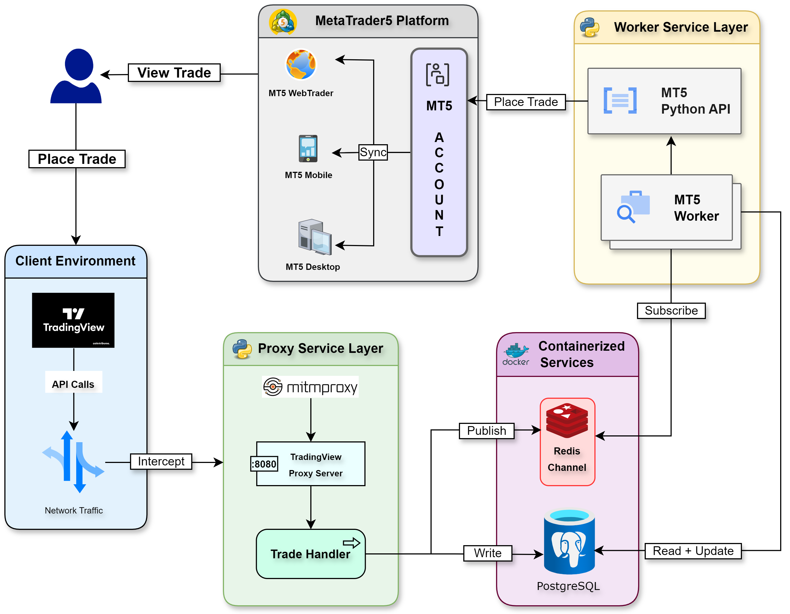

# TradingView to MT5 Trade Copier -  System Architecture

## **Setup and Installation**
For setting up this application, please refer [Setup](./docs/Setup.md)

## **System Overview**
This document describes a sophisticated trading system architecture that enables copying trades from TradingView to the MetaTrader5 (MT5) platform. The system is designed with multiple layers to ensure reliable trade execution, data persistence, and synchronization across various MT5 terminals.

---

## **Architecture Components**

### **1. Client Environment**
- **TradingView Browser/Desktop**: The entry point where trades are placed.
- **Network Traffic**: Handles API calls from TradingView to the proxy service layer.

### **2. Proxy Service Layer**
- **mitmproxy**: Intercepts and monitors network traffic from TradingView.
- **Proxy Server**: Extracts and validates the payload from intercepted traffic.
- **Trade Handler**: Processes trade data and distributes it to appropriate containerized services.

### **3. Containerized Services**
- **Redis Pub/Sub**: Manages real-time message queuing between Proxy and Worker service layers.
- **PostgreSQL Database**: Provides persistent storage for trade data and system state.

### **4. Worker Service Layer**
- **MT5 Worker**: Subscribes to Redis messages and prepares trades for execution.
- **MT5 Python API**: Interfaces with the MetaTrader5 platform for trade execution.

### **5. MetaTrader5 Platform**
- **MT5 Account**: Central trading account where orders are placed.
- **Multiple Terminals**: Trades get synchronized across web, mobile and desktop applications.

---

## **Data Flow**
1. Trading signals originate from TradingView browser/desktop.
2. The proxy service layer intercepts and processes these signals by continuously listening to TradingView network traffic.
3. Trade data is:
   - Stored in PostgreSQL for persistence and analysis.
   - Published to Redis for real-time message handling.
4. MT5 Worker subscribes to Redis messages and executes trades via the MT5 Python API.
5. Orders are placed in MT5 and synchronized across all terminals.

---

## **Key Features**
- **Scalability**: Containerized services allow for easy scaling.
- **Reliability**: Multiple layers ensure robust trade execution.
- **Persistence**: Trade data is stored for analysis and auditing.
- **Multi-platform Access**: Synchronized trading across different devices.
- **Real-time Processing**: Redis pub/sub enables immediate trade execution.

---

## **Security Considerations**
- **Secure Interception**: Network traffic interception is handled securely through `mitmproxy`.
- **Isolated Database Access**: Database access is containerized and isolated.
- **Encrypted Communication**: MT5 API communications are encrypted.
- **Validation Layers**: Multiple validation layers prevent unauthorized trade execution.

---

This architecture provides a robust foundation for automated trading while maintaining flexibility for future enhancements and scaling requirements.
